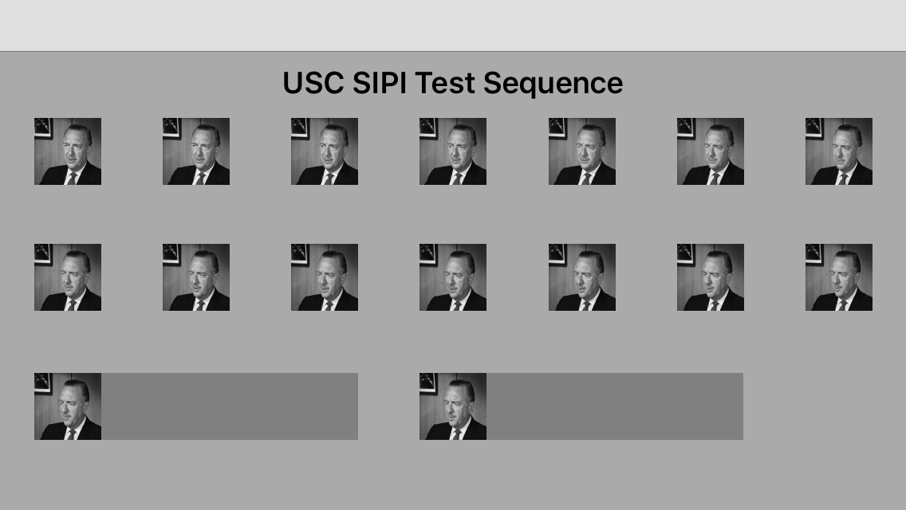

# AutoFrameLayout
This prototype resulted from shifting between two healthcare networks and "bringing my own data" - specifcally some reference x-rays. Additionally, I had RAW image pixel frames - MR scans from research work in the early 1990s research - that I was interested in displaying in a native iOS application. 

I accomplished both goals by image conversions - from DICOM into a standard more common web ready image format and from RAW to viewable form by class RawImageFrame. To avoid obvious issues with HIPAA and PHI, I replaced medical image data sets with a test image sequence from the USC SIPI data store.

This frame layout iteration is a continuation of explorations of Collection Views, Auto Layout and Interface Builder. This iteration illustrates the use of PureLayout; was built with Version 7.1 and was tested using iOS 9.1 on an iPhone 5.

| Gesture | Action |
|---|---|
| *Single Finger Tap* | Zoom In |
| *Two Finger Tap* | Zoom Out |
| *Three Finger Tap* | Close Current Image  |

Lessons learned are being applied to consider Stack Views now ported over to iOS UIKit in 9.x from OSX in Cocoa.

- The dynamic thumbnail layout is enabled by the PureLayout open source code. 

- There is a very simple JSON store that provides a key to the asset catalog for the test pattern. The concrete DataProvider implementation adheres to a simple IDataProvider protocol.

- Reuses ScrollableImageViewController that I wrote - an image viewer based on Scroll Views and intuitive touch gestures. The primary details logged are coordinates and other calculations related to display pipeline i.e. the image data, view and frame.

A breakdown of the broad areas where code has been under construction is listed below.

- Viewables
- Layout
- Capture
- Encrypt
- Filter

# Screens

# Next Steps

Some work needed to scrub post iOS 9.x and XCode 7.x warnings, beyond that - code iterations under way or planned include.

*Layouts*

The concentration has been on data storage and display, but work underway includes more realistic data navigation around user features. The evaluation of dynamic layout approaches will continue with a deeper five into Stack Views and Auto Layout. The degree of reliance of Interface Builder against manually code view management has been an area of ongoing investigation.

A drawer view to provide additional meta data beyond the displayable image has also been an area of experimentation with the data sourced from JSON or a remote store.

# Reference Code:

-[SwiftlyJSON](https://github.com/SwiftyJSON/SwiftyJSON)

-[PureLayout](https://github.com/PureLayout)

-[GPUImage](https://github.com/BradLarson/GPUImage)

# Test Image Patterns

The test images are from the Sequences volume in the test data set fom the USC Viterbi - School of Engineering.

[Signal and Image Processing Institute ](http://sipi.usc.edu/database/database.php)
